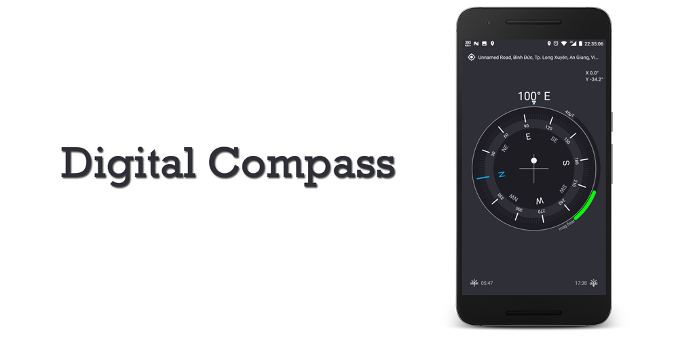
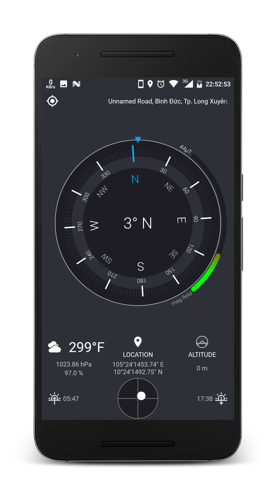

## Overview

This application was developed to help people learn how to develop compass application.

Use two sensors are the ACCELEROMETER sensor and the MAGNETIC FIELD sensor to calculate azimuth value and display in CompassView

Use the api of the OpenWeatherMap to display weather information.
For more information, please visit https://openweathermap.org

## Some screenshots

